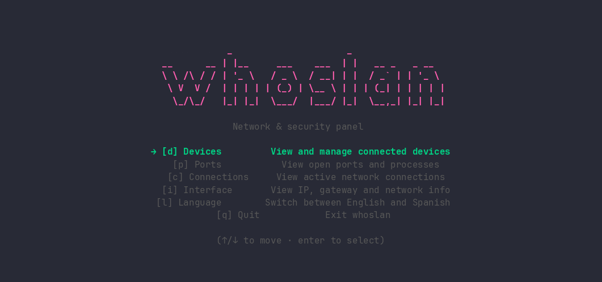

# whoslan

A terminal UI for keeping an eye on your local network and your machine's exposure — who's connected, what's listening, what's talking to the outside world.

Built with [Bubble Tea](https://github.com/charmbracelet/bubbletea), inspired by the "lazy" family of TUIs (lazygit, lazydocker).



## Features

- **Devices** — scans your local network and lists every device it finds, with vendor, IP, MAC, online/offline status, and how long it's been connected or disconnected. Persists history across sessions, flags new devices you haven't seen before, and lets you rename devices for easy recognition.
- **Ports** — shows which ports on your machine are in `LISTEN` state and which process owns them. Remembers previously seen ports and flags new ones that showed up since last time.
- **Connections** — lists active outbound/inbound connections, the owning process, and the country the remote IP resolves to (cached locally to avoid repeated lookups).
- **Interface** — a quick summary of your local IP, netmask, gateway, and public IP.
- **Bilingual** — English and Spanish, toggle anytime from the menu.
- **Keyboard-driven** — every screen is fully navigable without a mouse.

## Requirements

- Linux (uses `/proc` and Linux-specific networking info)
- [`arp-scan`](https://github.com/royhills/arp-scan) installed and available in your `PATH`
- `sudo` access (required by `arp-scan` to send raw ARP packets)

Install `arp-scan` on Debian/Ubuntu/Mint:

```bash
sudo apt install arp-scan
```

## Installation

```bash
go install github.com/maurocosentino/whoslan@latest
```

This installs the `whoslan` binary into `$(go env GOPATH)/bin`. Make sure that directory is in your `PATH`:

```bash
export PATH=$PATH:$(go env GOPATH)/bin
```

## Usage

```bash
whoslan
```

whoslan will ask for your `sudo` password once at startup (needed for network scanning) and keep the session alive in the background while it runs, so you won't be prompted again mid-use.

### Flags

| Flag | Default | Description |
|---|---|---|
| `--interface` | `enp1s0` | Network interface to scan (e.g. `enp1s0`, `wlan0`) |
| `--lang` | `en` | Interface language (`en` or `es`) |

Example:

```bash
whoslan --interface wlan0 --lang es
```

## Keybindings

**Menu**

| Key | Action |
|---|---|
| `↑` / `↓` or `j` / `k` | Navigate |
| `enter` | Select |
| `d` | Go to Devices |
| `p` | Go to Ports |
| `c` | Go to Connections |
| `i` | Go to Interface |
| `l` | Toggle language (English ↔ Español) |
| `q` | Quit |

**Devices / Ports / Connections**

| Key | Action |
|---|---|
| `↑` / `↓` or `j` / `k` | Navigate |
| `s` | Scan / refresh |
| `a` | Toggle acknowledged flag (Devices, Ports) |
| `r` | Rename selected device (Devices only) |
| `esc` | Back to menu |

## How it works

whoslan shells out to `arp-scan` to discover devices on your local network, and uses [gopsutil](https://github.com/shirou/gopsutil) to read listening ports and active connections directly from the system, without needing extra tools installed for those two screens.

Everything is persisted locally under `~/.local/share/whoslan/`:

- `history.json` — device history (first seen, last seen, name, acknowledged status)
- `ports_history.json` — port history
- `geo_cache.json` — cached country lookups for remote IPs, to avoid re-querying the same IP

New devices or ports are flagged with `!` until you acknowledge them with `a`. This flag doesn't expire on its own — it's meant to stay there until you've actually looked at it, even if you don't check the app for days.

## Why sudo?

`arp-scan` needs to craft raw ARP packets, which requires elevated privileges (`CAP_NET_RAW`). whoslan asks for your password once, upfront, before starting the interface — this avoids a background scan silently prompting for a password behind the TUI, which would otherwise steal your keystrokes.

If you'd rather avoid the sudo prompt entirely, you can grant the capability directly to the `arp-scan` binary instead:

```bash
sudo setcap cap_net_raw+ep $(which arp-scan)
```

## License

MIT